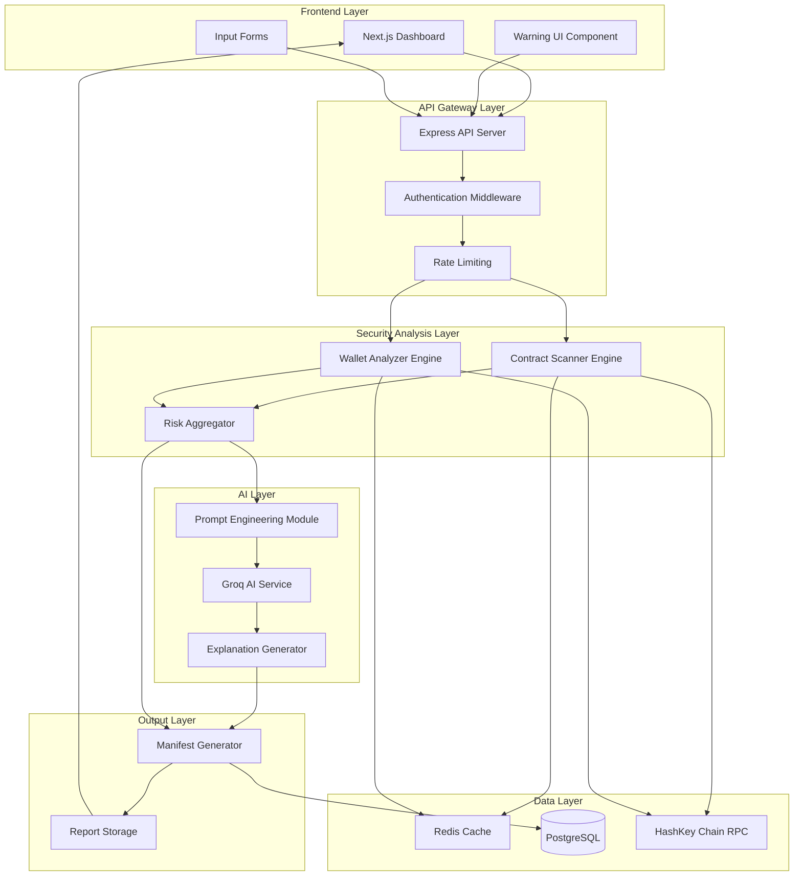
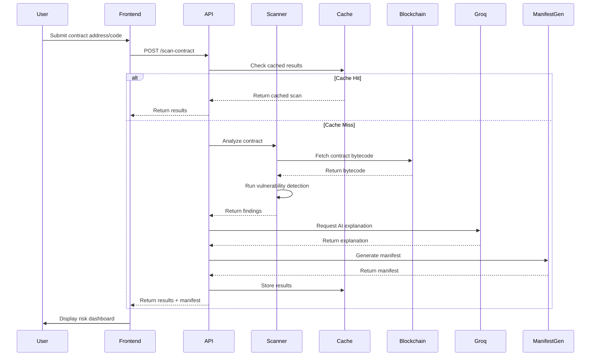
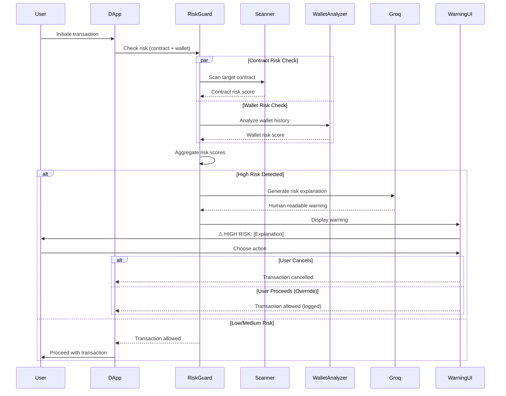
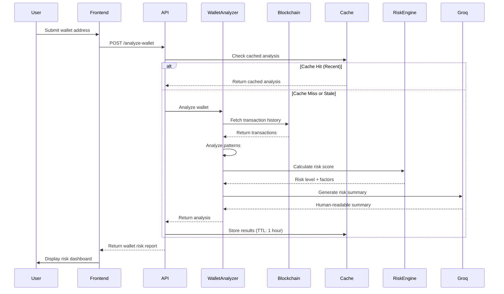

# Design Document: AI DeFi Security & Risk Guard

## Overview

The AI DeFi Security & Risk Guard is a real-time security layer for DeFi applications on HashKey Chain that prevents users and developers from interacting with unsafe smart contracts and risky wallets. The system combines smart contract security scanning, wallet behavior analysis, and AI-powered explanations (via Groq) to provide real-time transaction risk warnings before users execute potentially dangerous operations.

The core problem addressed is that DeFi users interact with contracts blindly, and existing security tools are complex, slow, and not user-friendly. This system provides a proactive security guard that scans contracts for vulnerabilities, analyzes wallet risk history, uses AI to explain risks in simple language, and warns users before they interact with risky entities. The output is a verifiable security report (assurance manifest) that provides transparency and accountability.

## Killer Differentiators (10/10 Features)

### 1. Pre-Transaction Risk Guard (PRIMARY DIFFERENTIATOR)
Unlike traditional security tools that scan AFTER deployment or interaction, our system STOPS users BEFORE they interact with risky contracts. This is the main selling point - proactive prevention rather than reactive detection.

**Key Value**: Real-time interception at the moment of transaction initiation, preventing users from losing funds before it's too late.

### 2. Ultra-Fast AI Explanations (Groq Advantage)
Leveraging Groq's ultra-low latency AI inference, the system provides instant, human-readable security warnings with attack scenarios and fix suggestions in real-time. This makes the demo feel incredibly responsive and production-ready.

**Key Value**: Real-time AI security warnings with sub-second latency, making complex vulnerabilities understandable to non-technical users.

### 3. Verifiable Assurance Manifests (Proof System)
Most security tools just display results. Our system generates cryptographically verifiable JSON manifests that serve as proof of security analysis. These manifests can be shared, audited, and verified independently.

**Key Value**: Transparency and accountability through verifiable security reports that can be used for compliance, audits, and trust-building.

### 4. Clean Visual Risk Indicators (UX Excellence)
The UI uses clear, color-coded risk indicators that grab attention instantly:
- 🟢 SAFE (Green) - Proceed with confidence
- ⚠️ WARNING (Yellow) - Exercise caution
- 🔴 CRITICAL (Red) - Do not interact

**Key Value**: Instant visual feedback that makes security status obvious at a glance, winning user attention and trust immediately.

## Architecture

The system follows a layered architecture with clear separation between frontend presentation, backend orchestration, security analysis engines, and AI explanation services.



## Sequence Diagrams

### Contract Scan Flow



### Pre-Transaction Risk Guard Flow (Main Feature)



### Wallet Analysis Flow



## Components and Interfaces

### Component 1: Frontend Dashboard (Next.js)

**Purpose**: Provides user interface for contract scanning, wallet analysis, and risk visualization

**Interface**:
```typescript
interface DashboardProps {
  onScanContract: (input: ContractInput) => Promise<ScanResult>
  onAnalyzeWallet: (address: string) => Promise<WalletRiskReport>
  onRiskCheck: (params: RiskCheckParams) => Promise<RiskCheckResult>
}

interface ContractInput {
  type: 'address' | 'source'
  value: string
  chainId?: number
}

interface ScanResult {
  contractAddress: string
  riskScore: number
  status: 'safe' | 'warning' | 'critical'
  issues: SecurityIssue[]
  aiExplanation: string
  manifest: AssuranceManifest
  timestamp: string
}
```

**Responsibilities**:
- Accept contract address or source code input
- Accept wallet address input
- Display risk scores with CLEAR VISUAL INDICATORS (🟢 SAFE / ⚠️ WARNING / 🔴 CRITICAL)
- Show detailed vulnerability findings
- Display AI-generated explanations in plain language
- Render BLOCKING warning UI for high-risk transactions (pre-transaction guard)
- Export assurance manifest as downloadable JSON
- Provide transaction simulation interface
- Show real-time status updates during scanning

### Component 2: API Gateway (Express)

**Purpose**: Orchestrates requests between frontend and backend services, handles authentication and rate limiting

**Interface**:
```typescript
interface APIEndpoints {
  'POST /api/scan-contract': (req: ScanContractRequest) => Promise<ScanContractResponse>
  'POST /api/analyze-wallet': (req: AnalyzeWalletRequest) => Promise<AnalyzeWalletResponse>
  'POST /api/risk-check': (req: RiskCheckRequest) => Promise<RiskCheckResponse>
  'GET /api/manifest/:id': (req: ManifestRequest) => Promise<AssuranceManifest>
  'GET /api/health': () => Promise<HealthStatus>
}

interface ScanContractRequest {
  contractAddress?: string
  sourceCode?: string
  chainId: number
  apiKey?: string
}

interface ScanContractResponse {
  success: boolean
  data?: ScanResult
  error?: ErrorDetails
  rateLimitRemaining: number
}
```

**Responsibilities**:
- Route incoming requests to appropriate services
- Validate request parameters and authentication
- Enforce rate limiting (per API key or IP)
- Handle errors and return standardized responses
- Log requests for audit trail
- Manage CORS and security headers

### Component 3: Contract Scanner Engine

**Purpose**: Analyzes smart contracts for security vulnerabilities and unsafe patterns

**Interface**:
```typescript
interface ContractScanner {
  scanByAddress(address: string, chainId: number): Promise<ScanResult>
  scanBySource(sourceCode: string, language: 'solidity' | 'vyper'): Promise<ScanResult>
  detectVulnerabilities(bytecode: string): Promise<SecurityIssue[]>
  analyzePatterns(ast: AST): Promise<SecurityIssue[]>
}

interface SecurityIssue {
  type: VulnerabilityType
  severity: 'low' | 'medium' | 'high' | 'critical'
  title: string
  description: string
  location?: CodeLocation
  recommendation: string
  cweId?: string
}

type VulnerabilityType = 
  | 'reentrancy'
  | 'access-control'
  | 'arithmetic'
  | 'unchecked-call'
  | 'delegatecall'
  | 'timestamp-dependence'
  | 'tx-origin'
  | 'uninitialized-storage'
  | 'denial-of-service'
  | 'front-running'
```

**Responsibilities**:
- Fetch contract bytecode from blockchain
- Decompile bytecode for analysis (if source unavailable)
- Detect common vulnerability patterns (reentrancy, access control, etc.)
- Parse Solidity AST for pattern matching (if source available)
- Calculate risk score based on findings
- Generate structured vulnerability reports
- Support both address-based and source code-based scanning

### Component 4: Wallet Analyzer Engine

**Purpose**: Analyzes wallet transaction history and interaction patterns to assess risk level

**Interface**:
```typescript
interface WalletAnalyzer {
  analyzeWallet(address: string, chainId: number): Promise<WalletRiskReport>
  fetchTransactionHistory(address: string, limit: number): Promise<Transaction[]>
  detectSuspiciousPatterns(transactions: Transaction[]): Promise<RiskFactor[]>
  calculateRiskScore(factors: RiskFactor[]): Promise<number>
}

interface WalletRiskReport {
  walletAddress: string
  riskLevel: 'low' | 'medium' | 'high'
  riskScore: number
  factors: RiskFactor[]
  transactionCount: number
  suspiciousInteractions: number
  aiSummary: string
  timestamp: string
}

interface RiskFactor {
  type: RiskFactorType
  severity: 'low' | 'medium' | 'high'
  description: string
  evidence: string[]
  weight: number
}

type RiskFactorType =
  | 'risky-contract-interaction'
  | 'high-frequency-trading'
  | 'suspicious-token-transfers'
  | 'mixer-usage'
  | 'blacklisted-address'
  | 'flash-loan-activity'
  | 'rug-pull-participation'
```

**Responsibilities**:
- Fetch wallet transaction history from blockchain
- Identify interactions with known risky contracts
- Detect suspicious transaction patterns (high frequency, unusual amounts)
- Check against blacklists and known scam addresses
- Calculate composite risk score from multiple factors
- Generate human-readable risk summary
- Cache results with appropriate TTL

### Component 5: AI Explanation Layer (Groq)

**Purpose**: Converts technical security findings into human-readable explanations and recommendations

**Interface**:
```typescript
interface AIExplanationService {
  explainVulnerabilities(issues: SecurityIssue[]): Promise<string>
  explainWalletRisk(report: WalletRiskReport): Promise<string>
  generateAttackScenario(vulnerability: SecurityIssue): Promise<string>
  suggestFixes(issues: SecurityIssue[]): Promise<FixSuggestion[]>
}

interface FixSuggestion {
  issueType: VulnerabilityType
  recommendation: string
  codeExample?: string
  priority: 'low' | 'medium' | 'high'
}

interface GroqPromptConfig {
  systemPrompt: string
  temperature: number
  maxTokens: number
  model: string
}
```

**Responsibilities**:
- Format technical findings for AI processing
- Construct effective prompts for Groq API (optimized for ultra-low latency)
- Generate plain-language explanations of vulnerabilities (< 1 second with Groq)
- Create realistic attack scenarios for user education
- Provide actionable fix suggestions with code examples
- Handle API rate limits and errors gracefully
- Cache AI responses to reduce API costs
- Leverage Groq's speed advantage for real-time warnings

### Component 6: Risk Aggregator

**Purpose**: Combines contract and wallet risk scores into unified risk assessment

**Interface**:
```typescript
interface RiskAggregator {
  aggregateRisk(contractRisk: ScanResult, walletRisk: WalletRiskReport): Promise<AggregatedRisk>
  calculateCompositeScore(scores: RiskScore[]): Promise<number>
  determineRiskLevel(score: number): RiskLevel
}

interface AggregatedRisk {
  overallRiskScore: number
  overallRiskLevel: 'safe' | 'warning' | 'critical'
  contractRisk: number
  walletRisk: number
  recommendation: 'proceed' | 'caution' | 'block'
  reasoning: string
}

interface RiskScore {
  category: string
  score: number
  weight: number
}

type RiskLevel = 'safe' | 'warning' | 'critical'
```

**Responsibilities**:
- Combine contract and wallet risk scores
- Apply weighted scoring algorithm
- Determine overall risk level and recommendation
- Generate reasoning for risk assessment
- Support configurable risk thresholds
- Provide risk breakdown by category

### Component 7: Manifest Generator

**Purpose**: Creates verifiable assurance manifests (structured JSON reports) for security scans

**Interface**:
```typescript
interface ManifestGenerator {
  generateManifest(scanResult: ScanResult, metadata: ManifestMetadata): Promise<AssuranceManifest>
  signManifest(manifest: AssuranceManifest): Promise<SignedManifest>
  verifyManifest(signed: SignedManifest): Promise<boolean>
}

interface AssuranceManifest {
  version: string
  manifestId: string
  timestamp: string
  chainId: number
  contractAddress: string
  riskScore: number
  status: 'safe' | 'warning' | 'critical'
  issues: SecurityIssue[]
  aiVerification: {
    explanation: string
    attackScenarios: string[]
    recommendations: string[]
  }
  metadata: ManifestMetadata
}

interface ManifestMetadata {
  scannerVersion: string
  aiModel: string
  scanDuration: number
  cacheHit: boolean
}

interface SignedManifest extends AssuranceManifest {
  signature: string
  publicKey: string
}
```

**Responsibilities**:
- Generate structured JSON manifests (verifiable assurance proof)
- Include all scan results and AI analysis
- Add metadata (timestamps, versions, scan duration)
- Sign manifests for cryptographic verifiability (optional but recommended)
- Support manifest verification by third parties
- Store manifests for audit trail and compliance
- Provide manifest retrieval by ID
- Enable manifest sharing and export for transparency

## Data Models

### Model 1: ScanResult

```typescript
interface ScanResult {
  contractAddress: string
  chainId: number
  riskScore: number
  status: 'safe' | 'warning' | 'critical'
  issues: SecurityIssue[]
  aiExplanation: string
  manifest: AssuranceManifest
  timestamp: string
  scanDuration: number
  cacheHit: boolean
}
```

**Validation Rules**:
- contractAddress must be valid Ethereum address (0x + 40 hex chars)
- chainId must be positive integer
- riskScore must be between 0 and 100
- status must be one of: 'safe', 'warning', 'critical'
- issues must be non-empty array if status is 'warning' or 'critical'
- timestamp must be ISO 8601 format
- scanDuration must be non-negative number

### Model 2: SecurityIssue

```typescript
interface SecurityIssue {
  id: string
  type: VulnerabilityType
  severity: 'low' | 'medium' | 'high' | 'critical'
  title: string
  description: string
  location?: CodeLocation
  recommendation: string
  cweId?: string
  references?: string[]
}

interface CodeLocation {
  file?: string
  line?: number
  column?: number
  snippet?: string
}
```

**Validation Rules**:
- id must be unique within scan result
- type must be valid VulnerabilityType enum value
- severity must be one of: 'low', 'medium', 'high', 'critical'
- title must be non-empty string (max 200 chars)
- description must be non-empty string (max 1000 chars)
- recommendation must be non-empty string (max 500 chars)
- cweId must match pattern CWE-\d+ if provided
- references must be array of valid URLs if provided

### Model 3: WalletRiskReport

```typescript
interface WalletRiskReport {
  walletAddress: string
  chainId: number
  riskLevel: 'low' | 'medium' | 'high'
  riskScore: number
  factors: RiskFactor[]
  transactionCount: number
  suspiciousInteractions: number
  firstSeen: string
  lastActivity: string
  aiSummary: string
  timestamp: string
}
```

**Validation Rules**:
- walletAddress must be valid Ethereum address
- chainId must be positive integer
- riskLevel must be one of: 'low', 'medium', 'high'
- riskScore must be between 0 and 100
- transactionCount must be non-negative integer
- suspiciousInteractions must be non-negative integer
- suspiciousInteractions must be <= transactionCount
- firstSeen and lastActivity must be ISO 8601 format
- timestamp must be ISO 8601 format

### Model 4: RiskCheckParams

```typescript
interface RiskCheckParams {
  contractAddress: string
  walletAddress: string
  chainId: number
  transactionValue?: string
  transactionData?: string
}
```

**Validation Rules**:
- contractAddress must be valid Ethereum address
- walletAddress must be valid Ethereum address
- chainId must be positive integer
- transactionValue must be valid decimal string if provided
- transactionData must be valid hex string if provided

### Model 5: AssuranceManifest

```typescript
interface AssuranceManifest {
  version: string
  manifestId: string
  timestamp: string
  chainId: number
  contractAddress: string
  riskScore: number
  status: 'safe' | 'warning' | 'critical'
  issues: SecurityIssue[]
  aiVerification: {
    explanation: string
    attackScenarios: string[]
    recommendations: string[]
    model: string
    confidence: number
  }
  metadata: {
    scannerVersion: string
    scanDuration: number
    cacheHit: boolean
    blockNumber?: number
  }
}
```

**Validation Rules**:
- version must follow semver format (e.g., "1.0.0")
- manifestId must be unique UUID v4
- timestamp must be ISO 8601 format
- chainId must be positive integer
- contractAddress must be valid Ethereum address
- riskScore must be between 0 and 100
- status must be one of: 'safe', 'warning', 'critical'
- aiVerification.confidence must be between 0 and 1
- metadata.scannerVersion must follow semver format
- metadata.scanDuration must be non-negative number

## Error Handling

### Error Scenario 1: Invalid Contract Address

**Condition**: User submits malformed or non-existent contract address
**Response**: Return 400 Bad Request with validation error message
**Recovery**: Frontend displays error message and prompts user to correct input
**Logging**: Log validation failure with submitted address (sanitized)

### Error Scenario 2: Blockchain RPC Failure

**Condition**: Unable to fetch contract bytecode or transaction history from HashKey Chain RPC
**Response**: Return 503 Service Unavailable with retry-after header
**Recovery**: Implement exponential backoff retry (3 attempts), fallback to secondary RPC endpoint if available
**Logging**: Log RPC endpoint, error message, and retry attempts

### Error Scenario 3: Groq API Rate Limit

**Condition**: Groq API returns 429 Too Many Requests
**Response**: Return cached explanation if available, otherwise return scan results without AI explanation
**Recovery**: Queue request for retry after rate limit window, notify user that AI explanation is pending
**Logging**: Log rate limit hit, queue status, and retry schedule

### Error Scenario 4: Groq API Failure

**Condition**: Groq API returns error or timeout
**Response**: Return scan results with generic explanation template
**Recovery**: Fallback to rule-based explanation generator, retry Groq API in background
**Logging**: Log API error, fallback activation, and background retry status

### Error Scenario 5: Scanner Engine Crash

**Condition**: Contract scanner encounters unexpected error during analysis
**Response**: Return 500 Internal Server Error with error ID for support
**Recovery**: Log full error stack, alert monitoring system, return partial results if available
**Logging**: Log contract address, error stack trace, scanner state, and error ID

### Error Scenario 6: Cache Unavailable

**Condition**: Redis cache is down or unreachable
**Response**: Continue operation without cache (degraded performance)
**Recovery**: Bypass cache for reads and writes, alert monitoring system
**Logging**: Log cache failure, degraded mode activation, and performance impact

### Error Scenario 7: Database Connection Lost

**Condition**: PostgreSQL connection fails during manifest storage
**Response**: Return scan results to user, queue manifest for retry storage
**Recovery**: Implement connection pool with automatic reconnection, retry manifest storage
**Logging**: Log connection error, retry queue status, and reconnection attempts

### Error Scenario 8: High Risk Override

**Condition**: User chooses to proceed despite high-risk warning
**Response**: Log override decision with timestamp and risk details
**Recovery**: Allow transaction to proceed, store override event for audit
**Logging**: Log wallet address, contract address, risk score, override reason (if provided), and timestamp

## Testing Strategy

### Unit Testing Approach

Each component will have comprehensive unit tests covering:

**Contract Scanner Engine**:
- Test vulnerability detection for each vulnerability type
- Test bytecode parsing and decompilation
- Test risk score calculation with various input combinations
- Test error handling for malformed contracts
- Mock blockchain RPC calls

**Wallet Analyzer Engine**:
- Test transaction history parsing
- Test risk factor detection algorithms
- Test risk score calculation with different patterns
- Test blacklist checking
- Mock blockchain RPC calls

**AI Explanation Layer**:
- Test prompt construction for different vulnerability types
- Test response parsing and formatting
- Test fallback behavior when API fails
- Mock Groq API responses

**Risk Aggregator**:
- Test weighted scoring algorithm
- Test risk level determination thresholds
- Test edge cases (zero risk, maximum risk)
- Test recommendation logic

**Manifest Generator**:
- Test manifest structure generation
- Test signature creation and verification
- Test manifest serialization/deserialization
- Test UUID generation uniqueness

**Coverage Goal**: Minimum 80% code coverage for all components

### Property-Based Testing Approach

Use property-based testing to verify invariants and edge cases:

**Property Test Library**: fast-check (for TypeScript/JavaScript)

**Properties to Test**:

1. **Risk Score Monotonicity**: Adding more severe vulnerabilities should never decrease risk score
2. **Risk Level Consistency**: Risk level should always match risk score thresholds
3. **Manifest Integrity**: Signed manifests should always verify successfully with correct public key
4. **Address Validation**: All Ethereum addresses should pass validation or be rejected
5. **Score Bounds**: Risk scores should always be between 0 and 100
6. **Timestamp Ordering**: Scan timestamps should never be in the future
7. **Aggregation Commutativity**: Order of risk factors should not affect final score (if weights are equal)

**Example Property Test**:
```typescript
test('risk score increases with severity', () => {
  fc.assert(
    fc.property(
      fc.array(fc.record({
        type: fc.constantFrom(...vulnerabilityTypes),
        severity: fc.constantFrom('low', 'medium', 'high', 'critical')
      })),
      (issues) => {
        const score1 = calculateRiskScore(issues)
        const moreIssues = [...issues, { type: 'reentrancy', severity: 'critical' }]
        const score2 = calculateRiskScore(moreIssues)
        return score2 >= score1
      }
    )
  )
})
```

### Integration Testing Approach

Integration tests will verify end-to-end workflows:

**Test Scenarios**:

1. **Full Contract Scan Flow**: Submit contract → Scanner → Groq → Manifest → Response
2. **Full Wallet Analysis Flow**: Submit wallet → Fetch history → Analyze → Groq → Response
3. **Pre-Transaction Risk Check**: Submit risk check → Parallel scan + analysis → Aggregate → Warning
4. **Cache Hit Scenario**: Submit same contract twice, verify second request uses cache
5. **API Rate Limiting**: Submit multiple requests, verify rate limit enforcement
6. **Error Recovery**: Simulate RPC failure, verify fallback and retry logic

**Test Environment**:
- Use HashKey Chain testnet for blockchain interactions
- Use test Groq API key with separate rate limits
- Use separate test database and cache instances
- Mock external services where appropriate

**Integration Test Tools**:
- Supertest for API endpoint testing
- Testcontainers for database and cache setup
- Nock for HTTP mocking (when needed)

## Performance Considerations

**Caching Strategy**:
- Cache contract scan results for 24 hours (contracts are immutable)
- Cache wallet analysis for 1 hour (wallet activity changes frequently)
- Use Redis for distributed caching across API instances
- Implement cache warming for popular contracts

**Optimization Targets** (Groq Ultra-Low Latency Advantage):
- Contract scan: < 5 seconds for cached results, < 30 seconds for new scans
- Wallet analysis: < 3 seconds for cached results, < 15 seconds for new analysis
- Risk check: < 2 seconds (parallel execution of contract + wallet checks)
- AI explanation generation: < 1 second (Groq's ultra-fast inference)
- API response time: p95 < 10 seconds, p99 < 30 seconds
- Pre-transaction warning display: < 3 seconds total (scan + AI + render)

**Scalability Considerations**:
- Horizontal scaling of API servers behind load balancer
- Queue-based processing for heavy scans (optional for MVP)
- Rate limiting per API key: 100 requests/hour for free tier
- Database connection pooling (max 20 connections per instance)
- Groq API rate limit management (queue requests if needed)

**Resource Limits**:
- Maximum contract size: 24KB (Ethereum limit)
- Maximum transaction history: 10,000 transactions per wallet analysis
- Maximum concurrent scans per user: 3
- Request timeout: 60 seconds
- Response size limit: 5MB

## Security Considerations

**API Security**:
- Require API keys for all endpoints (except health check)
- Implement rate limiting per API key and per IP
- Use HTTPS only (TLS 1.3)
- Validate and sanitize all user inputs
- Implement CORS with whitelist of allowed origins

**Data Privacy**:
- Do not store private keys or sensitive user data
- Anonymize wallet addresses in logs (show first 6 and last 4 chars only)
- Implement data retention policy (delete old manifests after 90 days)
- Comply with GDPR for EU users (right to deletion)

**AI Safety**:
- Sanitize contract code before sending to Groq (remove potential prompt injections)
- Validate AI responses for malicious content
- Implement content filtering for AI-generated explanations
- Set maximum token limits to prevent excessive API costs

**Blockchain Security**:
- Use read-only RPC endpoints (no transaction signing)
- Verify contract addresses before fetching bytecode
- Implement timeout for blockchain calls (10 seconds)
- Use multiple RPC endpoints for redundancy

**Audit Trail**:
- Log all scan requests with timestamps
- Log all high-risk warnings and user overrides
- Store manifests for verifiability
- Implement tamper-proof logging (append-only)

**Threat Model**:
- Malicious users submitting crafted contracts to exploit scanner
- DDoS attacks on API endpoints
- Prompt injection attacks on AI layer
- Man-in-the-middle attacks on RPC communication
- Cache poisoning attacks

**Mitigation Strategies**:
- Sandbox contract analysis (isolated execution environment)
- Rate limiting and CAPTCHA for suspicious activity
- Input validation and sanitization at all layers
- Use authenticated RPC endpoints with API keys
- Implement cache key validation and TTL limits

## Dependencies

**Core Dependencies**:
- Node.js (v20+) - Runtime environment
- Express (v4.18+) - API server framework
- Next.js (v14+) - Frontend framework
- React (v18+) - UI library
- TypeScript (v5+) - Type safety

**Blockchain Dependencies**:
- ethers.js (v6+) - Ethereum library for RPC interaction
- viem (v2+) - Alternative lightweight Ethereum library
- HashKey Chain RPC endpoint - Blockchain data access

**AI Dependencies**:
- Groq SDK - AI explanation generation
- Groq API key - Authentication for AI service

**Security Analysis Dependencies**:
- @solidity-parser/parser - Solidity AST parsing
- slither-analyzer (optional) - Advanced static analysis tool
- mythril (optional) - Symbolic execution for vulnerability detection

**Data Storage Dependencies**:
- PostgreSQL (v15+) - Persistent storage for manifests and audit logs
- Redis (v7+) - Caching layer for scan results
- pg (v8+) - PostgreSQL client for Node.js
- ioredis (v5+) - Redis client for Node.js

**Testing Dependencies**:
- Vitest - Unit testing framework
- fast-check - Property-based testing
- Supertest - API integration testing
- Testcontainers - Docker containers for integration tests

**Development Dependencies**:
- ESLint - Code linting
- Prettier - Code formatting
- Husky - Git hooks
- tsx - TypeScript execution

**Infrastructure Dependencies**:
- Docker - Containerization
- Docker Compose - Local development environment
- Nginx (optional) - Reverse proxy and load balancer
- PM2 (optional) - Process manager for production

**Monitoring Dependencies** (Optional for MVP):
- Prometheus - Metrics collection
- Grafana - Metrics visualization
- Sentry - Error tracking
- Winston - Logging library

**External Services**:
- Groq API - AI explanation generation
- HashKey Chain RPC - Blockchain data access
- GitHub (optional) - Source code verification
- Etherscan API (optional) - Contract verification status


## Correctness Properties

*A property is a characteristic or behavior that should hold true across all valid executions of a system—essentially, a formal statement about what the system should do. Properties serve as the bridge between human-readable specifications and machine-verifiable correctness guarantees.*

### Property 1: Solidity Parsing Round-Trip

For any valid Solidity abstract syntax tree, parsing source code then printing it then parsing again should produce an equivalent AST structure.

**Validates: Requirement 1.2**

### Property 2: Vulnerability Detection Completeness

For any contract containing a known vulnerability pattern (reentrancy, access control, arithmetic, unchecked calls, delegatecall, timestamp dependence, tx.origin, or uninitialized storage), the Contract_Scanner should detect and report that vulnerability.

**Validates: Requirements 1.3, 1.4, 1.5, 1.6, 1.7, 1.8, 1.9, 1.10**

### Property 3: Risk Score Bounds Invariant

For any set of detected vulnerabilities, the calculated Risk_Score must always be between 0 and 100 inclusive.

**Validates: Requirements 1.11, 2.10**

### Property 4: Risk Level Classification Consistency

For any Risk_Score value:
- Scores 0-30 must be classified as "safe"
- Scores 31-70 must be classified as "warning"  
- Scores above 70 must be classified as "critical"

**Validates: Requirements 1.12, 1.13, 1.14, 2.11, 2.12, 2.13**

### Property 5: Scan Result Structure Completeness

For any completed contract scan, the result must include all required fields: contract address, risk score, status, issues list, AI explanation, manifest, and timestamp.

**Validates: Requirement 1.15**

### Property 6: Wallet Risk Factor Detection

For any wallet transaction history containing suspicious patterns (risky contract interactions, high-frequency trading, suspicious transfers, mixer usage, blacklisted addresses, flash loans, or rug pull participation), the Wallet_Analyzer should detect and report those risk factors.

**Validates: Requirements 2.3, 2.4, 2.5, 2.6, 2.7, 2.8, 2.9**

### Property 7: Wallet Analysis Structure Completeness

For any completed wallet analysis, the result must include all required fields: wallet address, risk level, risk score, factors list, transaction count, suspicious interactions count, and AI summary.

**Validates: Requirement 2.14**

### Property 8: AI Input Sanitization

For any contract code containing potential prompt injection patterns, the AI_Explanation_Service must sanitize the input before sending to Groq_API, removing or escaping malicious content.

**Validates: Requirement 3.9**

### Property 9: AI Response Validation

For any AI-generated explanation containing malicious content patterns, the AI_Explanation_Service must reject the response and return a safe fallback explanation.

**Validates: Requirement 3.10**

### Property 10: Risk Aggregation Consistency

For any combination of contract Risk_Score and wallet Risk_Score, the Risk_Aggregator must produce a deterministic overall risk assessment that reflects both inputs.

**Validates: Requirement 4.3**

### Property 11: Override Logging Completeness

For any user override of a high-risk warning, the system must log an entry containing: wallet address, contract address, risk score, timestamp, and override reason (if provided).

**Validates: Requirement 4.9**

### Property 12: Manifest JSON Validity

For any completed contract scan, the generated Assurance_Manifest must be valid, parseable JSON.

**Validates: Requirement 5.1**

### Property 13: Manifest ID Uniqueness

For any set of generated manifests, all manifest IDs must be unique and conform to UUID v4 format.

**Validates: Requirement 5.2**

### Property 14: Manifest Timestamp Format

For any generated manifest, the timestamp must be in valid ISO 8601 format.

**Validates: Requirement 5.3**

### Property 15: Manifest Required Fields

For any generated manifest, it must include: contract address, chain ID, risk score, risk level, security issues, AI explanations, and metadata.

**Validates: Requirements 5.4, 5.5, 5.6, 5.7, 5.8**

### Property 16: Manifest Signature Round-Trip

For any generated manifest, signing it then verifying the signature must always succeed with the correct public key.

**Validates: Requirements 5.9, 5.10**

### Property 17: Request Parameter Validation

For any API request with invalid parameters (malformed addresses, out-of-range scores, invalid formats), the API_Gateway must reject the request and return HTTP 400 with validation error details.

**Validates: Requirements 7.3, 7.5**

### Property 18: Input Sanitization

For any user input containing injection attack patterns (SQL injection, XSS, command injection), the API_Gateway must sanitize the input before processing.

**Validates: Requirement 7.8**

### Property 19: Request Logging Completeness

For any API request, the system must log an entry containing: timestamp, endpoint, parameters, and result status.

**Validates: Requirement 7.9**

### Property 20: Error Response Standardization

For any API error condition, the response must follow a standardized structure with: error code, error message, and error ID.

**Validates: Requirement 7.10**

### Property 21: Cache Hit Indicator Presence

For any scan result, the response must include a boolean cache hit indicator showing whether the result came from cache.

**Validates: Requirement 8.6**

### Property 22: Invalid Address Rejection

For any submitted contract or wallet address that doesn't match the Ethereum address format (0x + 40 hex characters), the system must return HTTP 400 with a validation error.

**Validates: Requirement 9.1**

### Property 23: Error Logging Completeness

For any system error, the log entry must include: error message, stack trace, context, timestamp, and unique error ID.

**Validates: Requirement 9.10**

### Property 24: Wallet Address Anonymization

For any wallet address logged by the system, the log entry must show only the first 6 and last 4 characters, with the middle replaced by "...".

**Validates: Requirement 10.2**

### Property 25: Contract Address Validation Before RPC

For any contract address submitted for scanning, the system must validate the address format before making any RPC calls to the blockchain.

**Validates: Requirement 10.5**

### Property 26: Cache Key Validation

For any cache key used for storing or retrieving data, the system must validate the key format to prevent cache poisoning attacks.

**Validates: Requirement 10.8**

### Property 27: AI Content Filtering

For any AI-generated explanation containing filtered content patterns (profanity, malicious links, sensitive data), the system must remove or replace the filtered content before returning to users.

**Validates: Requirement 10.9**

### Property 28: Ethereum Address Format Validation

For any address validation, the system must accept only strings with "0x" prefix followed by exactly 40 hexadecimal characters, and reject all other formats.

**Validates: Requirement 11.1**

### Property 29: Risk Score Range Validation

For any risk score validation, the system must accept only numeric values between 0 and 100 inclusive, and reject all values outside this range.

**Validates: Requirement 11.2**

### Property 30: ISO 8601 Timestamp Validation

For any timestamp validation, the system must accept only strings in valid ISO 8601 format (YYYY-MM-DDTHH:mm:ss.sssZ), and reject all other formats.

**Validates: Requirement 11.3**

### Property 31: Chain ID Validation

For any chain ID validation, the system must accept only positive integers (> 0), and reject zero, negative numbers, and non-integers.

**Validates: Requirement 11.4**

### Property 32: Severity Enum Validation

For any Security_Issue severity validation, the system must accept only the values: "low", "medium", "high", "critical", and reject all other values.

**Validates: Requirement 11.5**

### Property 33: Risk Level Enum Validation

For any Risk_Level validation, the system must accept only the values: "safe", "warning", "critical", and reject all other values.

**Validates: Requirement 11.6**

### Property 34: UUID v4 Format Validation

For any generated manifest ID, it must conform to UUID v4 format (8-4-4-4-12 hexadecimal pattern with version 4 indicator).

**Validates: Requirement 11.7**

### Property 35: CWE ID Pattern Validation

For any CWE ID validation, the system must accept only strings matching the pattern "CWE-" followed by one or more digits, and reject all other formats.

**Validates: Requirement 11.8**

### Property 36: Decimal String Validation

For any transaction value validation, the system must accept only valid decimal number strings (digits with optional decimal point), and reject non-numeric strings.

**Validates: Requirement 11.9**

### Property 37: Hexadecimal String Validation

For any transaction data validation, the system must accept only valid hexadecimal strings (0x prefix followed by hex digits), and reject all other formats.

**Validates: Requirement 11.10**

### Property 38: Scan Request Logging Completeness

For any scan request, the log entry must include: timestamp, request type (contract/wallet), target address, and request parameters.

**Validates: Requirement 13.1**

### Property 39: High-Risk Event Logging

For any high-risk warning or user override event, the system must log an entry with: event type, timestamp, risk score, addresses involved, and user action.

**Validates: Requirement 13.2**

### Property 40: API Error Logging Completeness

For any API error, the log entry must include: error message, stack trace, unique error ID, timestamp, and request context.

**Validates: Requirement 13.3**

### Property 41: RPC Failure Logging

For any blockchain RPC failure, the log entry must include: RPC endpoint URL, error message, retry attempt number, and timestamp.

**Validates: Requirement 13.4**

### Property 42: Groq API Rate Limit Logging

For any Groq_API rate limit hit, the log entry must include: timestamp, retry schedule, and queue status.

**Validates: Requirement 13.5**

### Property 43: Cache Failure Logging

For any cache failure, the log entry must include: failure type, timestamp, and degraded mode activation status.

**Validates: Requirement 13.6**
